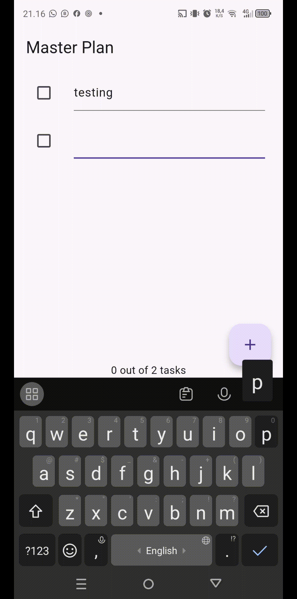
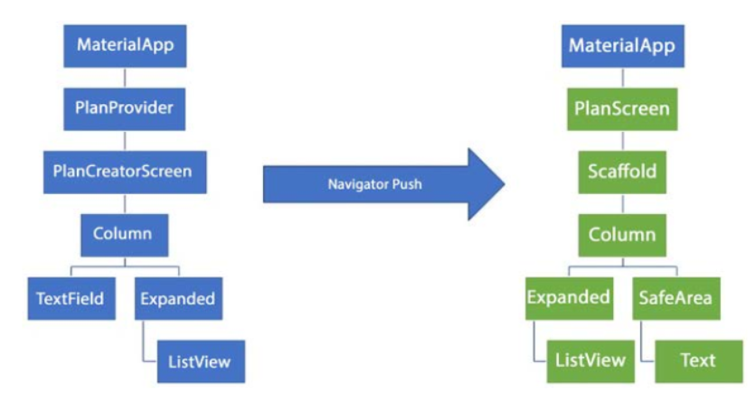

# Praktikum 1

## 1. Dokumentasi

## 2. Penjelasan Code data_layer.dart :
    export 'package:flutter_masterplan/Models/plan.dart';
    export 'package:flutter_masterplan/Models/task.dart';

Penjelasan :
Membungkus beberapa data layer ke dalam sebuah file yang nanti akan mengekspor kedua model tersebut. Dengan begitu, proses impor akan lebih ringkas seiring berkembangnya aplikasi.

## 2. variabel plan 
    Plan plan = const Plan();

Penjelasan :
Variabel plan di gunakan untuk menyimpan dan mengelola data. Kenapa di buat ? karna untuk mengetahui daftar tugas mana yang di tampilkan

## 3. Penjelasan Langkah 9
Komponen Task Tile
Fungsi _buildTaskTile() membuat ListTile dinamis untuk setiap tugas dalam rencana. Setiap tile mencakup:

- Checkbox untuk mengubah status penyelesaian tugas
- Field teks untuk mengedit deskripsi tugas

## 4. Fungsi Langkah 11 & 13
Langkah 11:
Scroll Listener : 
- Method initState() berguna untuk Inisialisasi scrollController dan menambahkan listener untuk menyembunyikan keyboard saat scroll. Dijalankan saat state pertama kali dibuat.

Langkah 13:
dispose() :
- Method dispose() berguna untuk membersihkan resource agar aplikasi tetap ringan dan tidak boros memori.

#

# Praktikum 2

## 1. Dokumentasi

## 2. Penjelasan InheritedWidget & InheritedNotifier
- Penjelasan InheritedWidget : untuk menyebarkan data ke seluruh widget yang berada dalam sub-hierarki widget tree tanpa perlu meneruskan data secara eksplisit melalui constructor. InheritedWidget digunakan pada plan_provider.dart.
- Penjelsan InheritedNotifier : karna lebih efisien yang secara otomatis rebuild jika ValueNotifier berubah,dengan menggunakan ValueNotifier.

## 3. Penjelasan pada langka 3
    int get completedCount => tasks
  .where((task) => task.complete)
  .length;

String get completenessMessage =>
  '$completedCount out of ${tasks.length} tasks';

Penjelasan :
- Method completedCount: Menghitung jumlah tugas dalam daftar task yang sudah di tandai sebagai selesai secara efisien.
- Method completenessMessage : Menghasilkan pesan status kemajuan tugas dalam format string, UI bisa langsung mengambil status tugas tanpa harus memproses ulang data.

## 4. Penjelasan langkah 9
Komponen widget SafeArea
- Menggunakan ValueListenableBuilder : untuk memantau perubahan Plan.
- Menggunakan completenessMessage : untuk Menampilkan pesan status berdasarkan progres tugas. 

#

# Praktikum 3

## 1. Dokumentasi

## 2. Penjelasan Diagram

Pejelasan :
Menggambarkan perubahan struktur widget dalam aplikasi Flutter setelah dilakukan navigasi menggunakan Navigator.push.

## 3. Penjelasan Langkah 14
Komponen widget _buildMasterPlans()
Menampilkan daftar rencana (Plan) jika tersedia. Jika tidak ada rencana, menampilkan pesan dan ikon . Memungkinkan navigasi ke PlanScreen untuk melihat detail rencana.

