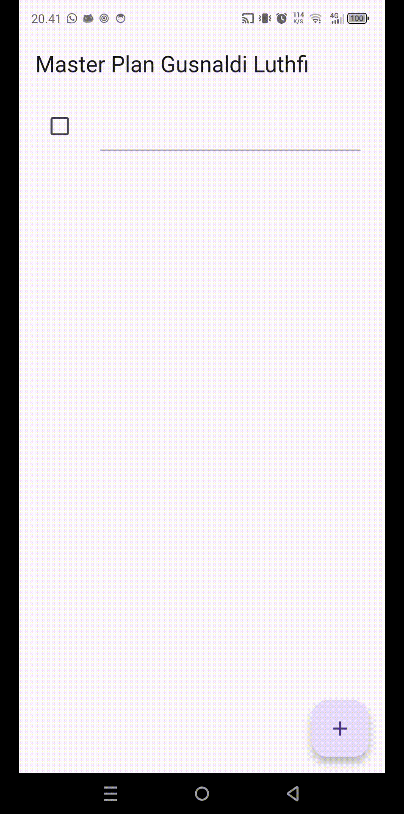

# Praktikum 1

## 1. Dokumentasi

## 2. Penjelasan Code data_layer.dart :
    export 'package:flutter_masterplan/Models/plan.dart';
    export 'package:flutter_masterplan/Models/task.dart';

Penjelasan :
Membungkus beberapa data layer ke dalam sebuah file yang nanti akan mengekspor kedua model tersebut. Dengan begitu, proses impor akan lebih ringkas seiring berkembangnya aplikasi.

## 2. variabel plan 
    Plan plan = const Plan();

Penjelasan :
Variabel plan di gunakan untuk menyimpan dan mengelola data. Kenapa di buat ? karna untuk mengetahui daftar tugas mana yang di tampilkan

## 3. Penjelasan Langkah 9
Komponen Task Tile
Fungsi _buildTaskTile() membuat ListTile dinamis untuk setiap tugas dalam rencana. Setiap tile mencakup:

- Checkbox untuk mengubah status penyelesaian tugas
- Field teks untuk mengedit deskripsi tugas

## 4. Fungsi Langkah 11 & 13
Langkah 11:
Scroll Listener : 
- Method initState() berguna untuk Inisialisasi scrollController dan menambahkan listener untuk menyembunyikan keyboard saat scroll. Dijalankan saat state pertama kali dibuat.

Langkah 11:
dispose() :
- Method dispose() berguna untuk membersihkan resource agar aplikasi tetap ringan dan tidak boros memori.

